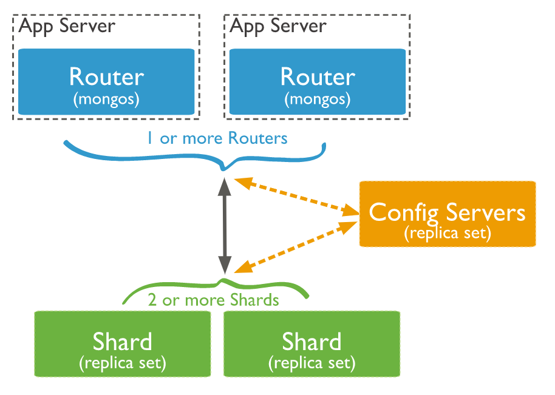

# MongoDB Sharding
데이터베이스의 스케일을 늘리는 방법은 크게 두 가지가 존재한다.

1. Vertical scaling: CPU, memory 등을 서버에 추가하는 방식
2. Horizontal scaling: 데이터셋을 다수의 서버에 분산시키는 방식

sharding이란 수평석 스케일링의 방법이다.
mongodb에서 샤딩은 콜렉션 레벨에서 이루어지게 된다.

## 아키텍처
mongodb에서 샤딩을 구현할 경우 아래와 같은 아키텍처로 구현이 가능하다.

- mongos: 유저가 데이터베이스와 소통하는 게이트웨이로써의 역할을 수행한다.
- config server: 각 샤드의 샤드키 등의 정보, 클러스터의 컨피그, 메타데이터를 가지고 있으며, mongos가 작업을 각 샤드에 뿌릴 때 참조하게 된다.
- shard: 실제 데이터셋을 가지고 있는 데이터베이스다.

## 샤딩 방식
1. Hashed sharding
2. Ranged sharding

해시샤딩은 샤드키를 해시해서 어느 샤드에 작업을 할당할 것인가는 결정하게 되는 방식이며, 레인지샤딩은 샤드키의 범위에 따라 작업할당 샤드를 결정하는 방식이다.
일반적으로 해시샤딩이 레인지샤딩보다 각 샤드에 균등한 데이터셋 분배가 가능하다.
하지만 해시샤딩은 범위 쿼리에 대하여 브로드캐스트 오퍼레이션을 수행할 가능성이 높다.
